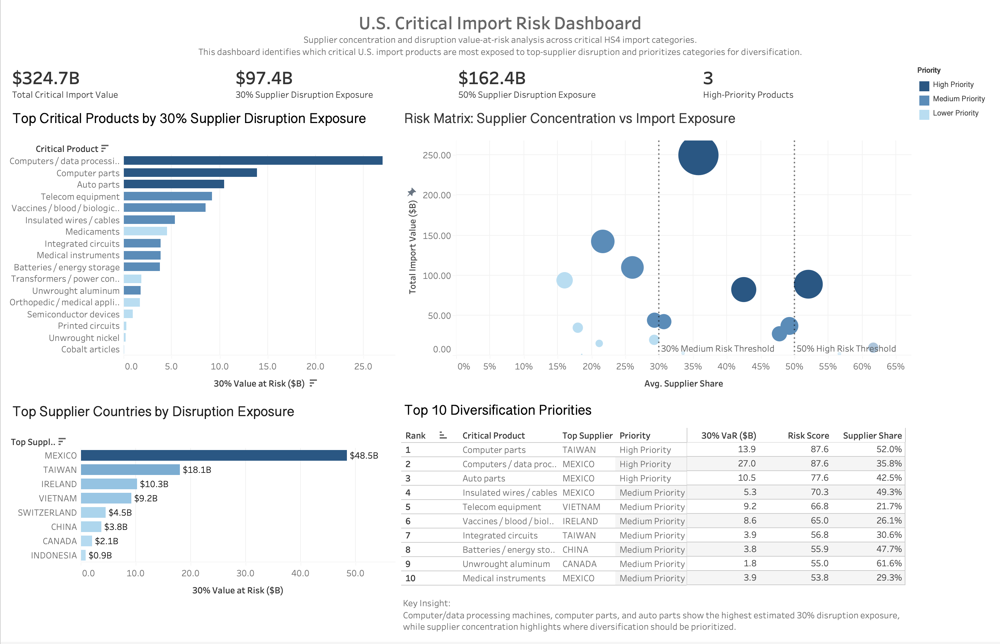

# U.S Supply Chain Fragility & Critical Import Risk Analysis

  

## Summary

This project analyzes U.S. critical import exposure across selected HS4 product categories and identifies where supplier-country disruption could create the largest supply chain risk.

The analysis estimates supplier concentration, disruption value at risk, and diversification priority for critical product categories such as computers, computer parts, auto parts, integrated circuits, telecom equipment, batteries, medical instruments, pharmaceuticals, and critical metals.

The final output is an executive Tableau dashboard supported by a Python data pipeline, PostgreSQL analysis views, and a documented risk scoring model.

## Business Question

If a top supplier country is disrupted, how much import value is exposed, and which critical product categories should be prioritized for supplier diversification?

## Business Context

Critical goods such as computers, semiconductors, telecom equipment, batteries, auto parts, medical instruments, pharmaceuticals, and key metals are often dependent on a small group of supplier countries.

That dependency creates risk, because disruption from a major supplier country can affect production timelines, cost stability, sourcing flexibility, and operational resilience.

This project estimates that risk by combining three signals:

* total import exposure
* disruption value at risk
* supplier concentration

## Tool used: 
	* Python: Census API extraction, data cleaning, validation, and initial EDA
	* Pandas: data transformation and CSV output generation
	* PostgreSQL: structured analytics layer
	* SQL: supplier concentration, disruption scenarios, risk scoring, and Tableau export views
	* Tableau: executive dashboard and data storytelling
	* Git/GitHub: version control and project documentation

## Data Source

The data comes from the U.S. Census International Trade API.

The analysis uses U.S. import data for selected HS4-level critical product categories from 2021–2025. Product categories include:

	* computers and computer parts
	* integrated circuits and semiconductor devices
	* telecom equipment
	* batteries and energy storage
	* auto parts
	* medical instruments
	* pharmaceuticals and biologics
	* critical metals such as nickel, aluminum, cobalt, and related inputs

The final dashboard uses the latest available year in the dataset for supplier concentration and disruption exposure analysis.

## Project Workflow

1. Data Collection
	* Python scripts were used to pull monthly U.S. import data from the Census API for selected critical HS4 codes.

2. Data Cleaning
	* The raw API output was cleaned and standardized before analysis. Cleaning steps included:

		+ renaming raw API fields into readable business terms
		+ converting dates and import values into correct data types
		+ removing aggregate records such as TOTAL FOR ALL COUNTRIES
		+ standardizing supplier country and product fields
		+ exporting cleaned datasets for SQL analysis

3. SQL Analysis Layer

	* The cleaned HS4 dataset was loaded into PostgreSQL. SQL views were created to calculate the core business metrics used in Tableau.

	Main SQL outputs include:
		+ supplier concentration by product
		+ top supplier country by product
		+ 30% and 50% disruption value-at-risk scenarios
		+ final weighted risk score
		+ Tableau-ready export view
4. Tableau Dashboard

	* The final Tableau dashboard presents the analysis including: 

		+ total critical import value
		+ 30% and 50% supplier disruption exposure
		+ high-priority product count
		+ top products by disruption exposure
		+ supplier concentration vs import exposure risk matrix
		+ top supplier countries by disruption exposure
		+ top 10 diversification priority ranking

## Metrics
	* Total Import Value: Total annual U.S. import value for each selected HS4 product category.

	* Top Supplier Share: Top Supplier Share = Top Supplier Import Value / Total Product Import Value

		Note: This measures how dependent each product category is on its largest supplier country.

	* Disruption Value at Risk:
		 30% Value at Risk = Top Supplier Import Value × 0.30
		 50% Value at Risk = Top Supplier Import Value × 0.50

			Note: These scenarios estimate how much import value would be exposed if the top supplier country experienced a moderate or severe disruption.

	* Final Risk Score
		Final Risk Score = 40% disruption exposure + 35% supplier concentration + 25% total import exposure

			Note: The weighting gives the highest importance to direct disruption exposure, followed by supplier dependency and overall import size.

## Key Findings
	* Computer/data processing machines, computer parts, and auto parts showed the highest estimated 30% disruption exposure.
	* Mexico and Taiwan represented the largest supplier-country exposure across the selected critical product categories.
	* Some products with lower total import value still showed high supplier concentration, making them important diversification candidates.
	* The risk matrix helped separate financial scale from supplier dependency, showing which products are large, concentrated, or both.

## Business Actions after Findings:
	* Prioritize diversification for the highest-ranked critical product categories.
	* Monitor products where top supplier share exceeds 30% and 50%.
	* Develop alternative sourcing strategies for products with both high import value and high supplier concentration.
	* Use disruption scenario analysis as a recurring supply-chain risk monitoring method.
	* Expand the model with logistics, political stability, and port dependency indicators for deeper country risk analysis.

